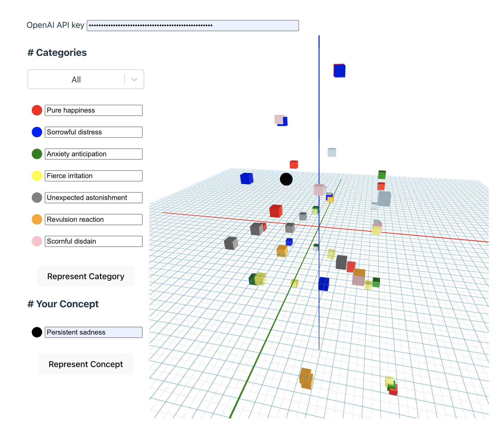

# Introducing Concept Viewer 🚀



## Instructions

```shell
# Clone the code
git clone https://github.com/tmarti/concept-viewer

# Install dependencies
yarn

# Run the local server
yarn dev
```

Now you can navigate to http://localhost:5173/